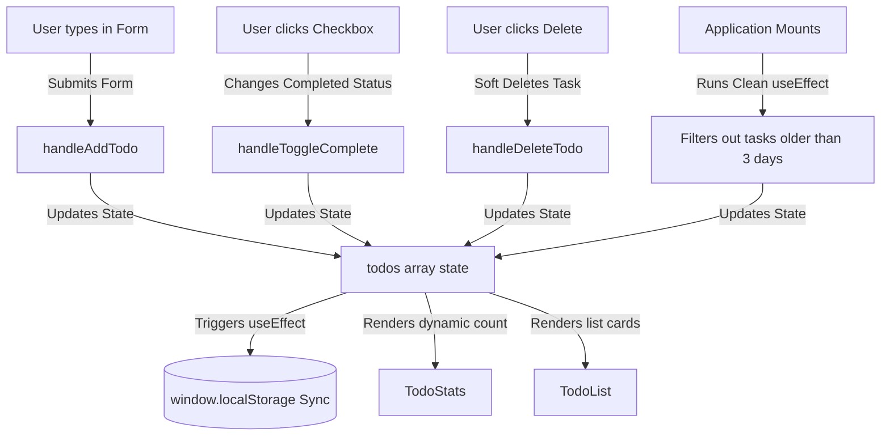

# ⚡ Taskflow // Basic Beginner Todo List

Taskflow is a clean, straightforward **React Todo List Workspace** built for the **Day 3 Frontend Assignment**. The application delivers an extremely easy-to-read and well-structured React architecture, utilizing only standard, beginner-level React hooks (`useState`, `useRef`, `useEffect`) to ensure maximum clarity and educational value.

---

## 🗺️ Visual Flowcharts & Hierarchies

To help easily explain how the application works, here are the component and data flow structures:

### 1. Component Tree Structure
The application maps a single-state orchestrator that feeds child components through simple parent-child props:

```text
               [ App.jsx ]
                    │
              [ TodoApp.jsx ] (Holds state & CRUD functions)
        ┌───────────┼───────────────┬────────────────┐
        │           │               │                │
   [ TodoForm ] [ TodoStats ] [ TodoFilters ]   [ TodoList ]
                                                     │
                                                [ TodoItem ] (xN)
```

### 2. State & Data Flow Pipeline
Below is a flowchart demonstrating how user interactions update state and save to local storage:



---

## 🚀 Core Features Demonstrated

This project addresses all of the essential assignment requirements in a lightweight, single-state framework:

### 1. ⚙️ `useState`: Simple Form Inputs & List Management
*   The **TodoForm** uses a single controlled text input state to collect new task titles.
*   The comprehensive task list is managed in `TodoApp` using a standard `todos` array state, guaranteeing immediate updates when tasks are added, edited, toggled, or deleted.

### 2. 🎯 `useRef`: Post-Submission Auto-Focus
*   The **TodoForm** references the task input element using a React `useRef` hook.
*   Upon form submission, the input field is cleared and instantly refocused via `inputRef.current.focus()`. This allows fast, continuous keyboard entry for multiple tasks.

### 3. 💾 `useEffect`: LocalStorage Persistence
*   A mounting `useEffect` reads and parses previously saved tasks from the browser's `localStorage` on load.
*   A second reactive `useEffect` monitors the `todos` array and automatically serializes and saves updates back to `localStorage` in JSON format on every change.

### 4. 🗑️ 3-Day Soft-Delete Trash Retention
*   When a user clicks "Delete" on an active task, it is soft-deleted: marked with a `deletedAt` timestamp and moved into the Trash bin.
*   Soft-deleted tasks in the Trash show an expiration countdown badge (e.g. `Expires in 3 days`).
*   On load, a mounting side effect calculates if the task has been in the trash for more than **3 days (259,200,000 ms)**. If so, it is automatically and permanently purged from the list!
*   Users can "Restore" a task from the Trash tab at any time, or "Delete Permanently" (which triggers a standard browser `confirm()` modal).

### 5. 🔀 Filter by Status & Search
*   Users can search active task titles dynamically via a text search input.
*   Filter tabs allow viewing tasks by: **All** (Active), **Active** (Pending), **Completed** (Done), and **Trash** (Soft-deleted).

### 6. 📝 Edit Existing Todo
*   Clicking the "Edit" button on a task populates the main input form with its current title and shifts focus directly to the input, enabling immediate changes.

---

## 📂 Modular Component Directory

The directory structure is cleanly organized, making it easy to explain to an evaluator:

```text
stikbook/
├── public/                   # Static assets
├── src/
│   ├── components/
│   │   ├── TodoApp.jsx       # Holds core useState, useEffect storage, and event handlers
│   │   ├── TodoFilters.jsx   # Search query input and status tabs (All, Active, Completed, Trash)
│   │   ├── TodoForm.jsx      # Task title input form featuring useRef auto-focus
│   │   ├── TodoItem.jsx      # Individual todo row cards with checkboxes, edit, and delete triggers
│   │   ├── TodoList.jsx      # Maps active card collections or outputs simple empty states
│   │   └── TodoStats.jsx     # Simple text badge displaying live stats counts
│   ├── App.jsx               # Root element rendering <TodoApp />
│   ├── index.css             # Layout styling sheets
│   └── main.jsx              # Mounts the React application
├── index.html                # App landing HTML file
├── package.json              # Vector icons and build packages
└── vite.config.js            # Vite build rules
```

---

## 🏃 Local Setup & Commands

Follow these basic commands to run the application locally:

### 1. Install Dependencies
```bash
npm install
```

### 2. Start the Local Server
```bash
npm run dev
```
Open `http://localhost:5173` in your browser.

### 3. Compile Production Bundle
```bash
npm run build
```
Generates highly optimized, static production files inside the `/dist` folder.
