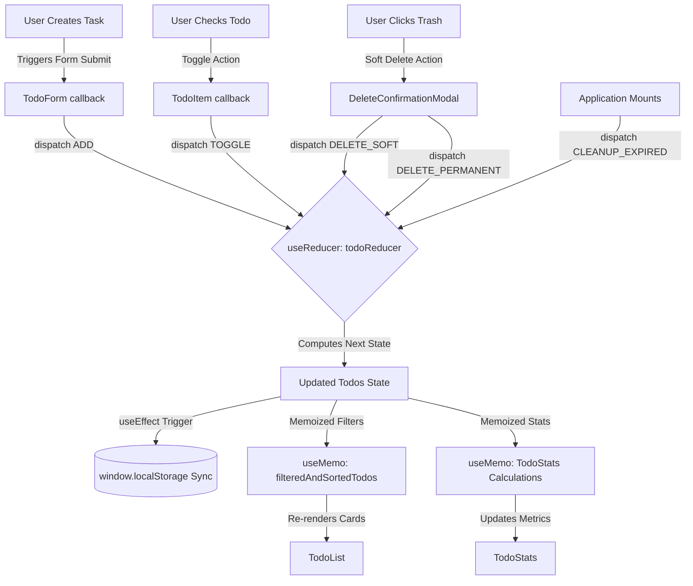

# ⚡ TASKFLOW // Premium Minimalist React Workspace

Taskflow is an enterprise-grade, highly optimized **React Todo Workspace** built with a gorgeous minimalist light design and advanced state architectures. By completely separating modules and applying strict rendering optimization patterns, the codebase provides an excellent educational standard for modern React engineering.

---

## 🗺️ Architectural Visualizations

To fully understand how data, states, and event triggers flow through Taskflow, review the visual mappings below.

### 1. Component Tree Hierarchy
The application is structured into highly focused, reusable components. Props flow downward, and dispatch triggers bubble upward:

```text
               [ App.jsx ] (Root Wrapper)
                    │
              [ TodoApp.jsx ] (Core Orchestrator & State Reducer)
        ┌───────────┼───────────────┬────────────────┐
        │           │               │                │
   [ TodoForm ] [ TodoStats ] [ TodoFilters ]   [ TodoList ]
                    │                                │
             (useMemo Stats)                 [ TodoItem ] (xN)
                                                     │
                                            (Expired Countdown)
```

### 2. State & Data Flow Pipeline
Below is the reactive pipeline showing how user actions dispatch state transitions, trigger persistent local storage synching, cache heavy listing queries, and execute the 3-day Soft Delete auto-cleanup mounting effect:



---

## 🛠️ Advanced Optimization Patterns

Taskflow is designed around React's most powerful functional hooks to guarantee fluid performance, memory safety, and strict rendering controls.

### 1. Centralized Actions with `useReducer`
Rather than scattering multiple `useState` setters across helper components, Taskflow uses a single core **reducer** function to manage state transitions. This prevents disjointed states and provides a clean, single point of truth:

```javascript
const todoReducer = (state, action) => {
  switch (action.type) {
    case 'ADD':
      return [action.payload, ...state];
    case 'UPDATE':
      return state.map(todo => todo.id === action.payload.id ? { ...todo, ...action.payload.todoData } : todo);
    case 'TOGGLE':
      return state.map(todo => todo.id === action.payload ? { ...todo, completed: !todo.completed } : todo);
    case 'RESTORE':
      return state.map(todo => todo.id === action.payload ? { ...todo, deletedAt: null } : todo);
    case 'DELETE_SOFT':
      return state.map(todo => todo.id === action.payload ? { ...todo, deletedAt: new Date().toISOString(), completed: false } : todo);
    case 'DELETE_PERMANENT':
      return state.filter(todo => todo.id !== action.payload);
    case 'CLEANUP_EXPIRED': {
      const threeDaysInMs = 3 * 24 * 60 * 60 * 1000;
      const now = Date.now();
      return state.filter(todo => {
        if (!todo.deletedAt) return true;
        const deletedTime = new Date(todo.deletedAt).getTime();
        const age = now - deletedTime;
        return age < threeDaysInMs;
      });
    }
    default:
      return state;
  }
};
```

### 2. Render Protection with `useCallback`
Passing raw, inline anonymous functions downward causes child components to reconstruct their event bindings and re-render on every cycle. Taskflow guards all downward action handlers using **`useCallback`** to keep memory references stable:

*   **Stable Identity**: Components like `TodoForm`, `TodoFilters`, and `TodoItem` receive memoized callback references. They do not trigger heavy DOM updates unless their specific target parameters have mutated.

### 3. Computations Caching with `useMemo`
Taskflow caches expensive array transformations so that simple typing or focus shifts do not trigger redundant recalculations:

*   **`filteredAndSortedTodos`**: Caches and indexes search queries, priority tags, categories, and status categories (All, Active, Completed, Trash).
*   **`TodoStats` calculations**: Prevents counting, parsing, and percentage division from executing on every typing stroke in the search filter.

---

## ♻️ The 3-Day Soft-Delete Engine

To provide a safe trash recovery experience, Taskflow implements a mathematical **Soft Delete** cycle matching your exact retention specifications.

### 1. The Soft-Delete Expiration Formula
When a task is moved to the Trash, the application stores a timestamp (`deletedAt: new Date().toISOString()`). The remaining time is reactively computed on render using the following mathematical logic:

$$\text{Remaining Time (ms)} = (3 \times 24 \times 60 \times 60 \times 1000) - (\text{Current Time} - \text{Deleted Time})$$

*   If the remaining time is **greater than 24 hours**, the badge renders: `Expires in X days`.
*   If the remaining time is **less than 24 hours**, the badge switches to active hours counting: `Expires in X hours`.
*   If the remaining time is **less than or equal to 0**, the engine marks it as: `Expiring now...`.

### 2. Mounting Expiration Side Effect
On initial workspace load, a mounting `useEffect` dispatches the `CLEANUP_EXPIRED` action. Any task flagged with a `deletedAt` timestamp older than **3 days (259,200,000 ms)** is instantly and permanently pruned from the array, keeping the user's `localStorage` footprint lightweight and clean.

---

## 📂 Modular Component Directory

The directory is divided to separate concerns and ensure a clean, maintainable structure:

```text
stikbook/
├── public/                   # Static browser assets
├── src/
│   ├── components/
│   │   ├── DeleteConfirmationModal.jsx # Danger confirmation alert overlay
│   │   ├── Toast.jsx         # Floating feedback notifications (Success, Info, Warning)
│   │   ├── TodoApp.jsx       # Main orchestrator, useReducer state, and useCallback bindings
│   │   ├── TodoFilters.jsx   # Search query, category selectors, and active status tabs
│   │   ├── TodoForm.jsx      # Task entries controlled via state (with useRef focus)
│   │   ├── TodoItem.jsx      # Task card card containing checkmarks and trash timers
│   │   ├── TodoList.jsx      # Maps list items and outputs custom empty states
│   │   └── TodoStats.jsx     # Stats cards tracking active, completed, and trashed counts
│   ├── App.jsx               # Root entry loading <TodoApp />
│   ├── index.css             # Minimalist light-themed CSS system
│   └── main.jsx              # StrictMode React mount loader
├── index.html                # Google Font Typography (Plus Jakarta Sans & Outfit)
├── package.json              # Vector Icons & build tools
└── vite.config.js            # Vite compiler rules
```

---

## 🏃 Local Setup & Operation

Follow these straightforward scripts to run the production-ready code locally:

### 1. Installation
Navigate to the root directory and install standard dependencies:
```bash
npm install
```

### 2. Launch Local Dev Server
Start the development server with Hot Module Replacement (HMR) capabilities:
```bash
npm run dev
```
Open `http://localhost:5173/` in your web browser to interact with the application.

### 3. Compile Production Bundle
To compile, bundle, and generate a highly optimized static build for online hosting:
```bash
npm run build
```
Static compiled code is outputted directly to the `/dist` directory.

---
*Created with 💜 as a high-end React Todo Dashboard.*
